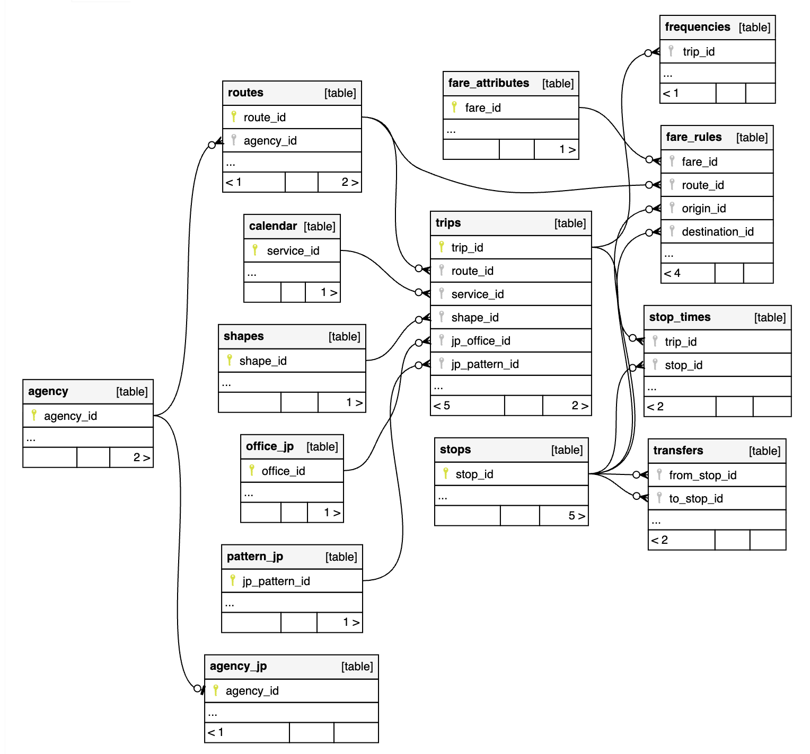

# gtfs-jp-db

国土交通省が整備している静的バス情報フォーマット（GTFS-JP）を、データベース化したリポジトリです。

GTFS-JP仕様書の第3版に準拠して作成しています。

作成したDBドキュメントは下記で確認可能です。

https://qazsato.github.io/gtfs-jp-db/

## 参考

- [静的バス情報フォーマット（GTFS-JP）仕様書［第 3 版］](https://www.mlit.go.jp/sogoseisaku/transport/content/001419163.pdf)
- [公共交通政策：技術資料（仕様書、ガイドライン） - 国土交通省](https://www.mlit.go.jp/sogoseisaku/transport/sosei_transport_tk_000112.html)
